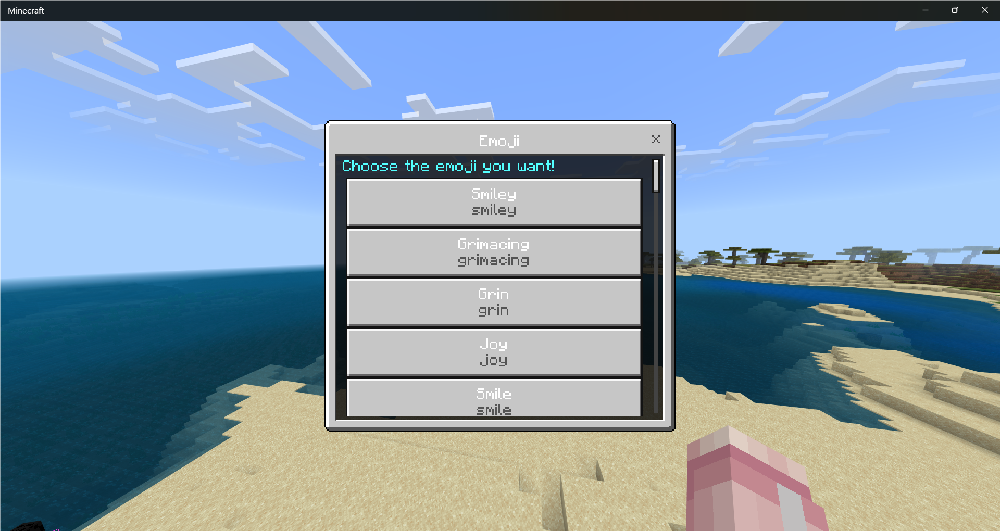
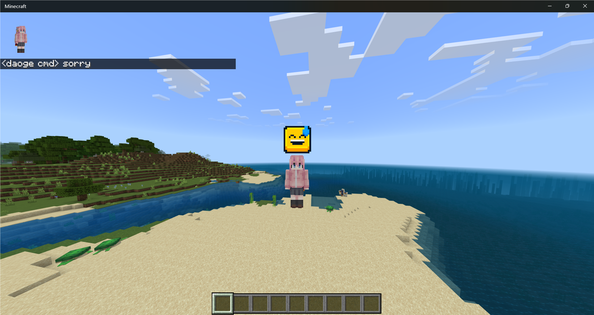

# Endstone Emoji Plugin

EmojiNK in endstone!

## Features

- [x] Command `/emoji`: Switch and send an emoji

## Installation

- Download plugin file (`.whl`) and resources pack (`.mcpack`)
  from the [release page](https://github.com/endstone-essentials/emoji/releases)
- Put `.whl` file into `plugins` folder
- Put `.mcpack` file into `resource_packs` folder
- Restart the server, enjoy!

## Requirement

Python: 3.10+

Endstone: 0.5+