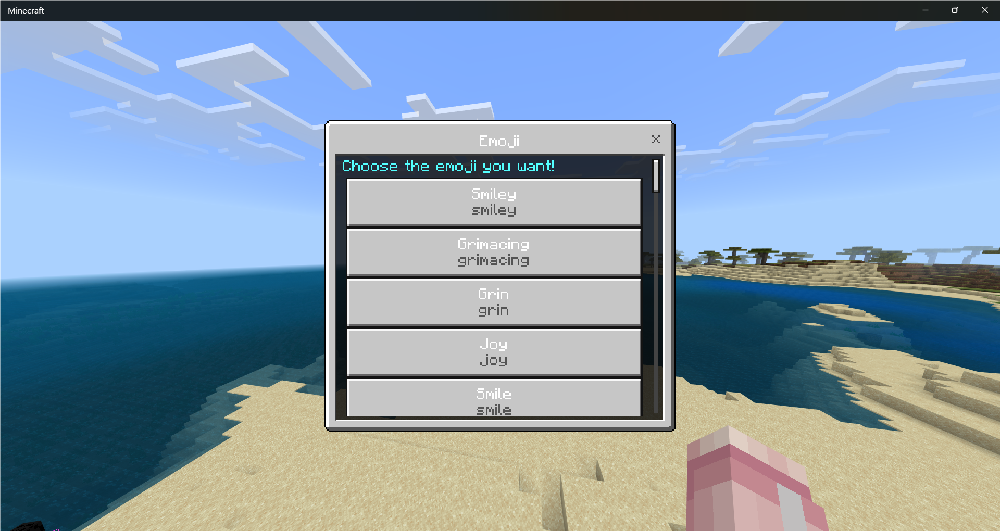
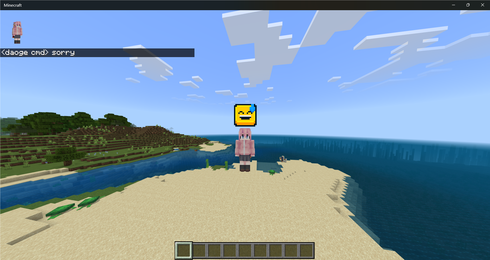

# Endstone Emoji Plugin

EmojiNK in endstone!

## Feature

- [x] `/emoji` Switch and send an emoji

## Install

- Download .whl file from [release](https://github.com/endstone-essentials/emoji/releases)
- Put it into `plugins` folder
- Restart the server, enjoy!

## Requirement

Python: 3.10+

Endstone: 0.5+